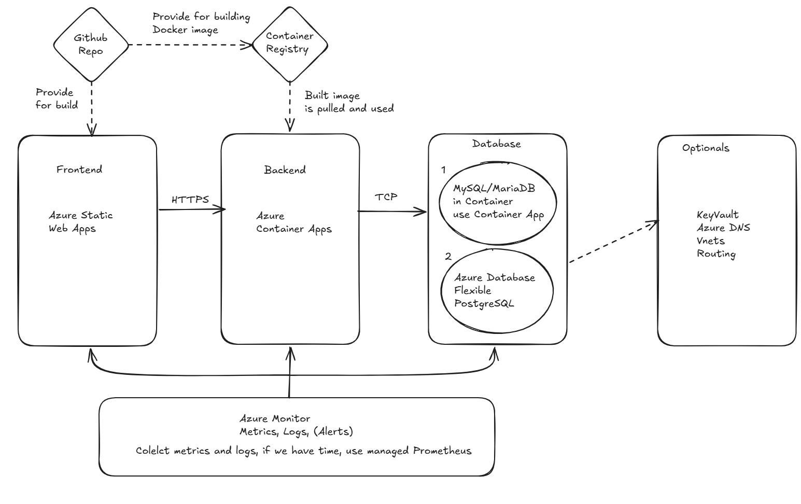

= Cloud Training - Product Backlog 2026
:toc:

This backlog contains all the tasks for the Cloud Training program, broken down by day. Each task is written so that you know exactly what to do and what you will learn.

== Target Architecture

The diagram below shows the end-to-end architecture you will build throughout the training week and final project. Use it as a reference while working through the tasks.

The main components are:

* *Your GitHub Repos* — source for building Docker images, also hosts the frontend (Static Web App)
* *Container Registry (ACR)* — stores built Docker images
* *Frontend* — Azure Static Web Apps, communicates with the backend over HTTPS
* *Backend* — Azure Container Apps, pulls image from ACR
* *Database* — either MySQL/MariaDB as a Container App, or Azure Database Flexible PostgreSQL
* *Azure Monitor* — collects metrics, logs, and alerts across all components
* *Optionals* — Key Vault, Azure DNS, VNets, Routing

== Day 1 — Docker Introduction (August 3, 2026)

*Presenter:* Elod Molnar

[cols="3,1", options="header"]
|===
| Task | Status

| *Attend the Docker Introduction presentation.* +
Follow along with the slides (`Docker Introduction.pptx`). You will learn what Docker is, why containers exist, and how they differ from virtual machines.
| To Do

| *Install Docker on your machine.* +
Make sure WSL, Ubuntu with Docker is installed and running. Verify by opening a terminal and typing `docker --version`.
| To Do

| *Run your first container.* +
Pull a simple image (e.g. `hello-world` or `nginx`) and run it. Understand the difference between an image and a running container.
| To Do

| *Build your own Docker image.* +
Write a `Dockerfile` for a simple application, build the image with `docker build`, and run it with `docker run`.
| To Do

| *Practice basic Docker commands.* +
Try `docker ps`, `docker images`, `docker stop`, `docker rm`, and `docker logs`. Get comfortable with the Docker CLI.
| To Do
|===

== Day 2 — Cloud Introduction (August 4, 2026)

*Presenter:* Stefan Lelutiu

[cols="3,1", options="header"]
|===
| Task | Status

| *Attend the Cloud Fundamentals and Azure presentation.* +
Learn what cloud computing is, the different service models (IaaS, PaaS, SaaS), and get an overview of Microsoft Azure.
| To Do

| *Create an Azure Static Web App.* +
Go to the Azure Portal, create a new Static Web App, and connect it to a frontend project on GitHub. The app will automatically build and deploy when you push code.
| To Do

| *Exercise: Set up a custom domain for your Static Web App.* +
Follow the Azure documentation to map a custom domain name to your Static Web App.
| To Do

| *Exercise: Configure routing rules in your Static Web App.* +
Add a `staticwebapp.config.json` file to define navigation fallback and route rules for your app.
| To Do

| *Learn about Azure Container Registry (ACR).* +
Understand what a container registry is and why you need one to store your Docker images in the cloud.
| To Do

| *Upload an existing Docker image to ACR.* +
Tag a local Docker image and push it to your Azure Container Registry using `docker push`.
| To Do

| *Build a Docker image locally and push it to ACR.* +
Build a new image from a Dockerfile, tag it with a proper version number (semantic versioning like `1.0.0`), and push it to ACR. Understand why versioning your images matters.
| To Do

| *Q&A — ask questions about anything covered today.* +
Write down anything you didn't understand and bring it up during the Q&A session.
| To Do

| *Stretch goal: Add identity/authentication to your Static Web App.* +
Enable a built-in authentication provider (like GitHub or Azure AD) so users can log in to your app.
| To Do
|===

== Day 3 — Container Apps (August 5, 2026)

*Presenter:* Andrei Florea

[cols="3,1", options="header"]
|===
| Task | Status

| *Attend the Azure Container Apps presentation.* +
Learn what Azure Container Apps (ACA) are, how they run your containers in the cloud, and see a live example with a database container app.
| To Do

| *Create your own Azure Container App.* +
Go to the Azure Portal and create a new Container App. Use the Docker image you pushed to ACR yesterday as the source image.
| To Do

| *Exercise: Change the configuration of your Container App.* +
Experiment with settings like CPU allocation, memory limits, min/max replicas, and environment variables. See how changes affect your running app.
| To Do

| *Connect the database Container App to your backend.* +
Set up networking so your backend Container App can talk to the database Container App. Verify the connection works end-to-end.
| To Do

| *Azure Key Vault* +
Create a Key Vault, store a secret (like a database password), and configure your Container App to read it. If not completed today, this will continue tomorrow.
| To Do

| *Q&A — ask questions about anything covered today.* +
Write down anything you didn't understand and bring it up during the Q&A session.
| To Do

|===

== Day 4 — Monitoring (August 6, 2026)

*Presenters:* Stefan Lelutiu / Andrei Florea

[cols="3,1", options="header"]
|===
| Task | Status

| *Attend the Azure Monitor introduction.* +
Learn what Azure Monitor is, how log collection works, and what metrics are available for your cloud resources.
| To Do

| *Set up monitoring on Backend.* +
Follow the live example to enable log collection and metrics on the Backend Container App. Learn how to query logs.
| To Do

| *Exercise: Add log collection to your backend and frontend apps.* +
Enable log collection and metrics for all of your deployed apps (Static Web App, backend Container App). Explore the collected data in the Azure Portal.
| To Do

| *Exercise: Build a monitoring dashboard.* +
Create a custom Azure Dashboard that shows key metrics (example: CPU usage, memory, request count, errors, lantency, etc.) for all your apps in one place.
| To Do

| *Final Q&A session and Cloud roles discussion.* +
Ask any remaining questions about the week. Discuss different Cloud roles (Cloud Engineer, DevOps Engineer, Cloud Architect) and what is expected in each.
| To Do
|===

== Day 5 — Self Learning (August 7, 2026)

[cols="3,1", options="header"]
|===
| Task | Status

| *Build the complete end-to-end flow.* +
Put everything together: deploy a frontend (Static Web App) that calls a backend (Container App) that connects to a database (Service). All running in Azure.
| To Do

| *Call the backend from Azure Static Web App.* +
Update your frontend (Static Web App) to make API calls to your backend Container App. Test the full flow: frontend → backend → database.
| To Do

| *Add monitoring to all components.* +
Set up Azure Monitor with log collection and metrics on every part of your application. Build a dashboard to visualize everything.
| To Do

| *Feedback.* +
Disuss about the week with the mentors, give feedback on what you liked and what could be improved for next time.
| To Do
|===

== Week 2 — Final Project (August 24–28, 2026)

*Mentors:* Andrei Florea / Stefan Lelutiu / Elod Molnar

=== W2-1: Containerize Your Final Project

[cols="1,2,4,1", options="header"]
|===
| Type | Task | Description | Status

| Epic
| Containerize your final project
| Create a complete containerized 3-tier application that runs locally with `docker compose`, ensuring all services communicate properly.
| To Do

| Task
| Create Dockerfile for frontend service
| Write a Dockerfile for your frontend that specifies the base image, dependencies, build steps, and entry point. Use multi-stage builds to minimize image size and optimize for development/production environments.
| To Do

| Task
| Create Dockerfile for backend service
| Create a Dockerfile for your backend application with appropriate runtime environment, dependency installation, and health check endpoints. Ensure the image exposes the correct port and has proper logging configured.
| To Do

| Task
| Create Dockerfile for database service
| Write a Dockerfile for your database service (MySQL/MariaDB or PostgreSQL) that initializes the database schema and creates necessary tables. Include environment variables for default credentials and initial database configuration.
| To Do

| Task
| Write docker-compose.yml orchestration file
| Create a `docker-compose.yml` that defines all three services, their networking, volumes for persistent data, environment variables, and dependencies. Ensure services are named appropriately for inter-service communication.
| To Do

| Task
| Test local build of all services
| Run `docker-compose build` and verify all three services build successfully without errors. Check for missing dependencies, incorrect Dockerfile syntax, or base image issues.
| To Do

| Task
| Test local run: start all services
| Execute `docker-compose up` and verify all services start without errors, then check the logs to confirm each service initialized successfully. Stop with `docker-compose down` and clean up any leftover containers.
| To Do

| Task
| Verify frontend is accessible locally
| Open a browser and navigate to the configured frontend port (e.g., `http://localhost:4200`) to confirm the frontend loads and renders correctly. Check browser console and network tab for any errors or failed asset loads.
| To Do

| Task
| Verify backend API responds locally
| Test the backend API by making HTTP requests to the configured port (e.g., `http://localhost:8080`) using curl or Postman. Verify the API returns expected responses and status codes for test endpoints.
| To Do

| Task
| Verify backend connects to database
| Check the container logs for the backend service (`docker-compose logs backend`) to confirm database connection strings are working and no connection errors appear. Test a database query endpoint if available.
| To Do

| Task
| Verify frontend can call backend API
| From the frontend application, make an API call to the backend and verify the response is received and processed correctly. Check network requests in browser DevTools to see the backend response.
| To Do

| Task
| Verify data persistence end-to-end
| Submit test data through the frontend form, verify it appears in the database, then refresh or restart the services and confirm the data persists. This validates the entire data pipeline.
| To Do

| Task
| Implement healthchecks in docker-compose
| Add healthcheck directives to each service in `docker-compose.yml` so Docker can monitor service availability. Configure appropriate intervals and success/failure thresholds for each service type.
| To Do

|===

=== W2-2: Deploy to Azure

[cols="1,2,4,1", options="header"]
|===
| Type | Task | Description | Status

| Epic
| Deploy to Azure
| Deploy a fully functional 3-tier application to Azure with proper networking and integration.
| To Do

| Task
| Create ACR
| Go to the Azure Portal and create a new Azure Container Registry resource: https://learn.microsoft.com/en-us/azure/container-registry/container-registry-get-started-portal?tabs=azure-cli
| To Do

| Task
| Build and push frontend image to ACR
| Use `docker build` to create the frontend image locally, tag it with your ACR registry URL and a version number (e.g., `v1.0.0`), then push it using `docker push`. Verify the image appears in your Azure Container Registry.
| To Do

| Task
| Build and push backend image to ACR
| Build the backend Docker image locally, tag it appropriately for your ACR registry with a semantic version, and push it to ACR. Confirm the image is accessible and correctly tagged in the registry.
| To Do

| Task
| Build and push database image to ACR
| Build the database Docker image locally, tag it with your ACR URL and version number, then push it to ACR. Ensure the image includes the database initialization scripts and default schema.
| To Do

| Task
| Create Azure Static Web App for frontend
| Go to the Azure Portal and create a new Static Web App resource, connecting it to your GitHub repository where the frontend code is stored. Configure the build output directory and deployment triggers.
| To Do

| Task
| Create Container Apps environment in Azure
| Create a new Container Apps environment in your Azure subscription to host the backend and database services. This environment provides networking, monitoring, and orchestration for your containers.
| To Do

| Task
| Deploy backend Container App from ACR
| Create a new Container App in the environment, configure it to use the backend image from ACR, set the exposed port, and configure initial environment variables. Set appropriate CPU and memory allocations.
| To Do

| Task
| Deploy database Container App from ACR
| Create another Container App for the database service using the image from ACR. Configure storage/volumes for persistent data, set environment variables for credentials, and ensure proper port exposure within the Container Apps environment.
| To Do

| Task
| Configure networking between backend and database
| Enable internal networking in Container Apps so the backend Container App can communicate with the database Container App. Use the internal DNS name (e.g., `database:5432`) for connections.
| To Do

| Task
| Configure frontend Static Web App API endpoint
| Update your frontend code to use the backend Container App URL (get this from the Container App ingress settings) as the API endpoint. Commit and push this change to trigger an automatic deployment.
| To Do

| Task
| Verify end-to-end deployment flow
| Test the complete flow: access the frontend via Static Web App, make API calls to the backend, and verify data is read/written to the database. Confirm all three services communicate correctly in the cloud.
| To Do

|===

=== W2-4: Secure Your Application

[cols="1,2,4,1", options="header"]
|===
| Type | Task | Description | Status

| Epic
| Secure your application
| Harden the deployed solution by protecting secrets, enforcing encrypted traffic, and reducing public exposure.
| To Do

| Task
| Audit codebase for secrets
| Search your entire codebase (including config files, environment files, documentation) for any exposed credentials like database passwords, API keys, connection strings, and JWT secrets. Document all findings in a spreadsheet or checklist.
| To Do

| Task
| Create Azure Key Vault
| Create a new Azure Key Vault resource in your subscription to centrally store and manage all secrets. This will serve as the single source of truth for sensitive configuration across all services.
| To Do

| Task
| Migrate secrets to Key Vault
| Create secrets in Azure Key Vault for each identified secret using clear naming conventions (e.g., `db-password`, `api-key`, `jwt-secret`). Record the secret names and versions for reference during Container App configuration.
| To Do

| Task
| Remove hardcoded secrets from code
| Delete all hardcoded secret values from your source code and configuration files to ensure they are never committed to Git. Verify no credentials remain by doing a final code audit.
| To Do

| Task
| Enable managed identity on backend Container App
| In the Azure Portal, navigate to your backend Container App and enable a system-assigned managed identity. This identity will be used to authenticate with Key Vault to retrieve secrets.
| To Do

| Task
| Enable managed identity on database Container App
| Enable a system-assigned managed identity on your database Container App. This allows the database service to securely access any Key Vault secrets it needs (if applicable).
| To Do

| Task
| Grant Key Vault access to backend identity
| In Azure Key Vault's Access Policies, add your backend Container App's managed identity with "Get" and "List" permissions for secrets. This allows the backend to read secrets it needs.
| To Do

| Task
| Configure backend to read from Key Vault
| Update your backend Container App environment variables to use Key Vault references instead of plain values (use `@Microsoft.KeyVault(SecretUri=...)` syntax). Redeploy the backend to apply changes.
| To Do

| Task
| Verify backend loads secrets from Key Vault
| Check backend Container App logs to confirm it started successfully and loaded secrets from Key Vault without errors. Verify no secret values are printed in logs; only "successfully loaded" messages should appear.
| To Do

| Task
| Enforce HTTPS on frontend Static Web App
| In the Static Web App settings, ensure all HTTP traffic is redirected to HTTPS and verify the SSL certificate is valid. Test by accessing both http:// and https:// URLs and confirm only HTTPS works.
| To Do

| Task
| Enforce HTTPS on backend Container App
| Update your backend Container App ingress settings to accept only HTTPS connections. Configure your frontend and any test clients to use https:// URLs when calling the backend API.
| To Do

| Task
| Configure private ingress on database Container App
| Set the database Container App to "Internal" ingress mode so it is only accessible from within the Container Apps environment, never from the public internet. Verify the database is not reachable from outside Azure.
| To Do

| Task
| Verify frontend-to-backend HTTPS connection
| Test that the frontend can still successfully call backend API endpoints via HTTPS. Check for any SSL certificate warnings or connection errors in network logs.
| To Do

| Task
| Verify backend-to-database connection over private network
| Confirm the backend Container App can still connect to the database Container App using the internal DNS name. Check backend logs for any connection errors.
| To Do

| Task
| Perform final security audit
| Search the codebase, configuration files, and Git history for any remaining plaintext secrets or credentials. Use tools like GitGuardian or git-secrets to automate this check.
| To Do

| Task
| Test end-to-end flow after security changes
| Perform a complete test of the entire application (frontend → backend → database) to ensure all functionality still works after implementing security hardening. Verify no data loss or broken features.
| To Do

|===

=== W2-5: Set Up Monitoring and Dashboards

[cols="1,2,4,1", options="header"]
|===
| Type | Task | Description | Status

| Epic
| Set up monitoring and dashboards
| Build practical observability for the full stack to detect issues, track performance, and respond to incidents.
| To Do

| Task
| Create Log Analytics workspace
| Create a new Azure Log Analytics workspace in your subscription to serve as the central repository for all logs and metrics from your application services. This workspace will enable querying and analysis of logs.
| To Do

| Task
| Attach Container Apps environment to Log Analytics
| In your Container Apps environment settings, configure the Log Analytics workspace as the destination for logs and metrics. This automatically routes all Container App logs to the workspace.
| To Do

| Task
| Enable diagnostics on Static Web App
| In the Static Web App resource settings, enable diagnostics and route logs to your Log Analytics workspace. Configure logging for HTTP requests, errors, and deployment events.
| To Do

| Task
| Verify data flowing into Log Analytics
| Wait a few minutes, then go to Log Analytics and run a simple query (e.g., `ContainerAppConsoleLogs` or `AppServiceHTTPLogs`) to confirm logs and metrics are being ingested. Check the data volume and timestamps.
| To Do

| Task
| Create ops dashboard in Azure Portal
| Create a new Azure Dashboard and name it `[project-name]-ops-dashboard`. This shared dashboard will display real-time health and performance metrics for your entire application.
| To Do

| Task
| Add CPU and memory tiles to dashboard
| Add metric tiles to the dashboard showing CPU utilization (average and peak) for backend and database services over the last 24 hours and 7 days. Include both percentage and absolute usage values.
| To Do

| Task
| Add request volume and error rate tiles
| Add tiles showing request count (requests per minute) and error rate (percentage and count of 4xx/5xx responses) for frontend and backend services. Set appropriate time ranges for visibility.
| To Do

| Task
| Add response latency tiles to dashboard
| Add tiles showing response latency percentiles (p50, p95) for backend API endpoints. Include both raw latency values and trend charts to identify performance degradation over time.
| To Do

| Task
| Add service health status row to dashboard
| Create a status tile showing the current health and availability of all three services (frontend, backend, database). Include current revision/version information where applicable.
| To Do

| Task
| Create alert: Backend CPU > 80% for 10 minutes
| In Azure Monitor, create an alert rule triggered when backend CPU usage exceeds 80% for a sustained 10-minute period. This helps identify resource contention issues early.
| To Do

| Task
| Create alert: Backend Memory > 80% for 10 minutes
| Create an alert rule for backend memory usage exceeding 80% over 10 minutes. This helps prevent out-of-memory crashes before they happen.
| To Do

| Task
| Create alert: Database CPU > 80% for 10 minutes
| Set up an alert rule for database CPU usage exceeding 80% for 10 minutes to detect database performance issues and potential query problems.
| To Do

| Task
| Create alert: Database Memory > 80% for 10 minutes
| Create an alert rule for database memory exceeding 80% over 10 minutes. This helps prevent memory pressure that could cause database service degradation or restarts.
| To Do

| Task
| Create alert: Backend error rate > 5% for 5 minutes
| Set up an alert rule triggered when backend error rate (4xx and 5xx responses) exceeds 5% over a 5-minute window. This detects application errors quickly.
| To Do

| Task
| Create alert: Backend latency (p95) above threshold
| Create an alert rule for backend response latency at the 95th percentile exceeding your agreed threshold (e.g., > 1 second). This detects performance degradation for users.
| To Do

| Task
| Create alert: Frontend Static Web App unavailable
| Set up an alert rule triggered when the frontend Static Web App becomes unavailable for the last 2 minutes. This ensures quick detection of deployment or hosting issues.
| To Do

| Task
| Create alert: Backend health checks failing
| Create an alert rule triggered when backend health check endpoints fail for 5 consecutive minutes. This provides early warning of backend service issues.
| To Do

| Task
| Configure alert action group for notifications
| Create an action group in Azure Monitor and configure it to send email or Teams notifications when any alert triggers. Assign this action group to all alerts created above.
| To Do

| Task
| Create query: top failing endpoints
| In Log Analytics, create and save a query that shows the HTTP endpoints with the highest error counts, sorted by frequency. Use this to quickly identify problem areas.
| To Do

| Task
| Create query: exception count by type
| Write and save a Log Analytics query that groups exceptions by type and shows counts. This helps identify systematic issues like specific error patterns.
| To Do

| Task
| Create query: slowest API routes (p95/p99)
| Create a saved query showing backend API routes ranked by their 95th and 99th percentile response times. This identifies performance bottlenecks in your API.
| To Do

| Task
| Create query: service restarts and revisions
| Write and save a query tracking Container App restarts, revision changes, and deployment events. This helps correlate service incidents with deployments.
| To Do

| Task
| Audit logs for sensitive data exposure
| Review your logs in Log Analytics to ensure no passwords, API keys, tokens, or other sensitive data appear in log output. Adjust application logging if necessary to prevent accidental secret exposure.
| To Do

| Task
| Validation: test dashboard with light traffic
| Generate light test traffic to your application (e.g., 10-20 requests per minute) and confirm all dashboard tiles update with fresh data within 1-2 minutes.
| To Do

| Task
| Validation: simulate backend error and verify alerts
| Intentionally trigger a 5xx error in the backend (e.g., force an exception) and verify that the error rate alert triggers and sends notifications within the configured threshold.
| To Do

| Task
| Validation: simulate high CPU load and check alerts
| Generate heavy load on the backend (e.g., with a load testing tool) to spike CPU usage above 80% and verify CPU alerts trigger and appear on the dashboard.
| To Do

| Task
| Verify incident diagnosis capability
| Simulate an issue (e.g., database unavailability) and confirm your team can identify the root cause (frontend vs backend vs database) using the dashboard, logs, and saved queries within a few minutes.
| To Do

|===

== Optional — API Testing & Docker Hardening & Cost Awareness

[cols="1,2,4,1", options="header"]
|===
| Type | Task | Description | Status

| Epic
| Optional: API testing, Docker hardening, and cost awareness
| Enhance developer experience, reduce attack surface, and monitor cloud costs.
| To Do

| Task
| Test APIs with Postman or Bruno
| Set up and run API tests using Postman or Bruno to validate backend endpoints in your AWS/Azure Dev environment. Create reusable test collections for regression testing and team onboarding.
| To Do

| Task
| Use minimal base images in Dockerfiles
| Replace your current base images with minimal alternatives (e.g., `alpine` or `distroless` instead of full OS images). This reduces image size by 10-100x and decreases the attack surface.
| To Do

| Task
| Run containers as non-root user
| Modify your Dockerfiles to create and use a non-root user for running your services. This prevents privilege escalation vulnerabilities and limits damage if a container is compromised.
| To Do

| Task
| Implement multi-stage Docker builds
| Restructure your Dockerfiles to use multi-stage builds, where build tools and dependencies are in early stages but not included in the final image. This keeps production images lean and secure.
| To Do

| Task
| Minimize installed packages in containers
| Review installed packages in your container images and remove unnecessary ones. Only keep packages required for runtime; move development/build tools to build stages or remove entirely.
| To Do

| Task
| Create cost awareness dashboard and alerts
| Set up Azure Cost Management or AWS Cost Explorer to track spending by resource and service. Create a dashboard showing daily/weekly costs and alerts when spending exceeds budgets (e.g., > $100/day).
| To Do

|===

== Optional — Advanced Networking & Optimization

[cols="1,2,4,1", options="header"]
|===
| Type | Task | Description | Status

| Epic
| Advanced networking and optimization
| Implement VNets, DNS, and performance optimizations.
| To Do

| Task
| Create Azure Virtual Network (VNet)
| Create a dedicated VNet in your subscription to isolate your application infrastructure from the public internet. Subnet the VNet to separate frontend, backend, and database traffic patterns.
| To Do

| Task
| Configure Azure DNS for custom domain
| Set up a custom domain name (if you have one) using Azure DNS and create DNS records that route to your Static Web App and Container Apps. This replaces using default Azure URLs with your own branded domain.
| To Do

| Task
| Implement CDN for frontend static assets
| Set up an Azure CDN (Content Delivery Network) in front of your Static Web App to cache and serve static assets (CSS, JS, images) from edge locations. This reduces latency for users globally and reduces origin server load.
| To Do

|===

