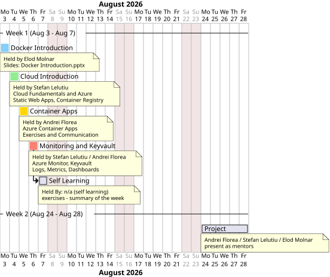

= Cloud Training Timeline - 2026
:toc:

This timeline covers the two training weeks scheduled for August 2026.

* *Week 1:* August 3 2026 - August 7 2026
* *Week 2:* August 24 2026 - August 28 2026

== Sessions

[cols="1,2,2,2", options="header"]
|===
| Date | Topic | Presenter | Material

| August 3 2026
| Docker Introduction
| Elod Molnar
| link:./resources/docker/Docker%20Introduction.pptx[Docker Introduction.pptx]

| August 4 2026
| Cloud Introduction
| Stefan Lelutiu
a| * Introduction
* Presentation with Cloud Fundamentals and Azure
* Static Web Apps - create app and build from frontend Github
* Exercises for SWA - custom domain, routing, identity
* Introduction into Container Registry
* Upload existing image, build image locally, discuss differences, semantic versioning
* Q&A session

| August 5 2026
| Container Apps
| Andrei Florea
a| * Presentation with Azure Container App - do example for DB container app
* Azure Container App - create container and build from container registry image they built yesterday
* Exercises for ACS - change configuration, cpu and mem, etc.
* Communication between ACS DB and backend and calling frontend from Azure Static Web App
* If there is time, read secret from Keyvault into container app - if not move to next day
* Q&A session

| August 6 2026
| Monitoring and optional Keyvault
| Stefan Lelutiu / Andrei Florea
a| * Continue with Keyvault if not done
* Introduce Azure Monitor with log collection and metrics
* Example on DB Container App
* Continue with exercises on the other apps to collect logs and metrics, develop dashboards
* Ultimate Q&A session about everything + discussion regarding Cloud roles - expectations

| August 7 2026
| Self learning
| Andrei Florea / Stefan Lelutiu / Elod Molnar
| Implement the whole flow from frontend to DB in ACA, with monitoring and Keyvault integration, using the materials provided during the week

| August 24-28 2026
| Project
| Andrei Florea / Stefan Lelutiu / Elod Molnar
| Mentors assisting at the final project

|===
